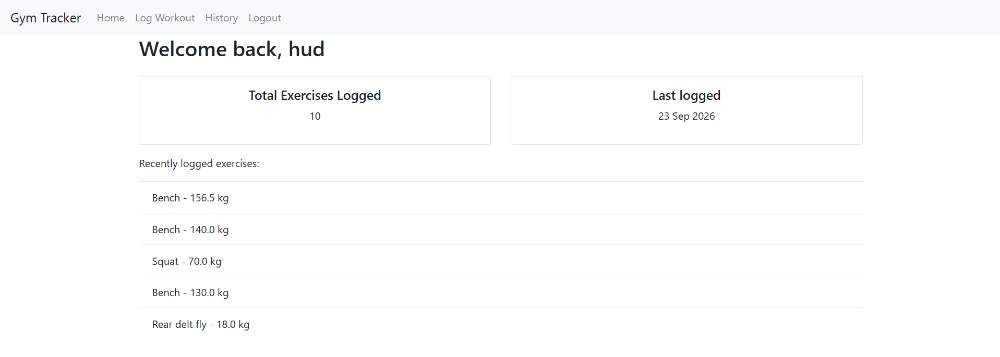
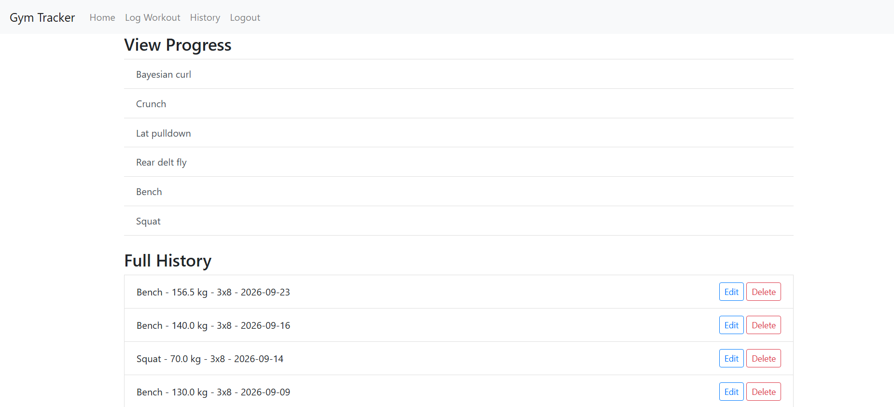
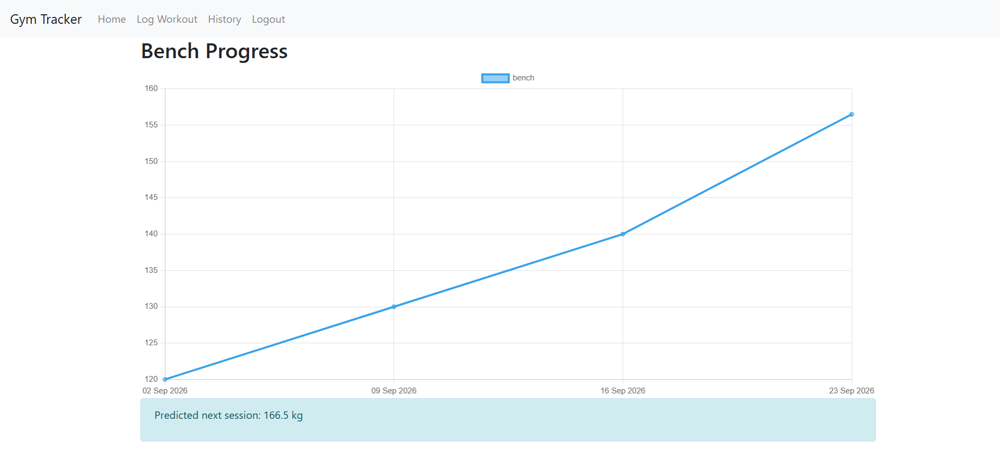

# Gym Tracker
 
Full-stack workout tracking web app built with Flask. Users can register an account, log workouts, view their history, track progress with interactive charts, and get an ML-based prediction for their next session's weight.
 
* User authentication (registration, login, password hashing, session management)
* Log workouts (exercise, weight, sets, reps, date) with full edit/delete support
* Workout history, ordered most recent first, with per-exercise progress links
* Progression chart per exercise using Chart.js
* Next-session weight prediction using a linear regression model trained on the user's own logged history
* Dashboard showing total workouts logged, last logged date, and recent activity

## Screenshots
 
### Homepage Dashboard

 
### Log a Workout

 
### Workout History

 
### Exercise Progress

 
 
## Live Demo
 
[View Live Demo](<https://gym-tracker-gu79.onrender.com>)
 
> Note: hosted on Render's free tier, so the first load after a period of inactivity may take 30-60 seconds while the server wakes up.
 
## Run Locally
 
1. Clone the repository
```
git clone https://github.com/hud-k/gym-tracker
```
 
2. Install dependencies
```
pip install -r requirements.txt
```
 
3. Create a `.env` file in the project root with:
```
SECRET_KEY=your-own-secret-key
```
 
4. Run the app
```
py run.py
```
 
## Tech Stack
 
* Flask
* SQLAlchemy (Flask-SQLAlchemy)
* Flask-Login
* SQLite
* Chart.js
* scikit-learn
* Bootstrap